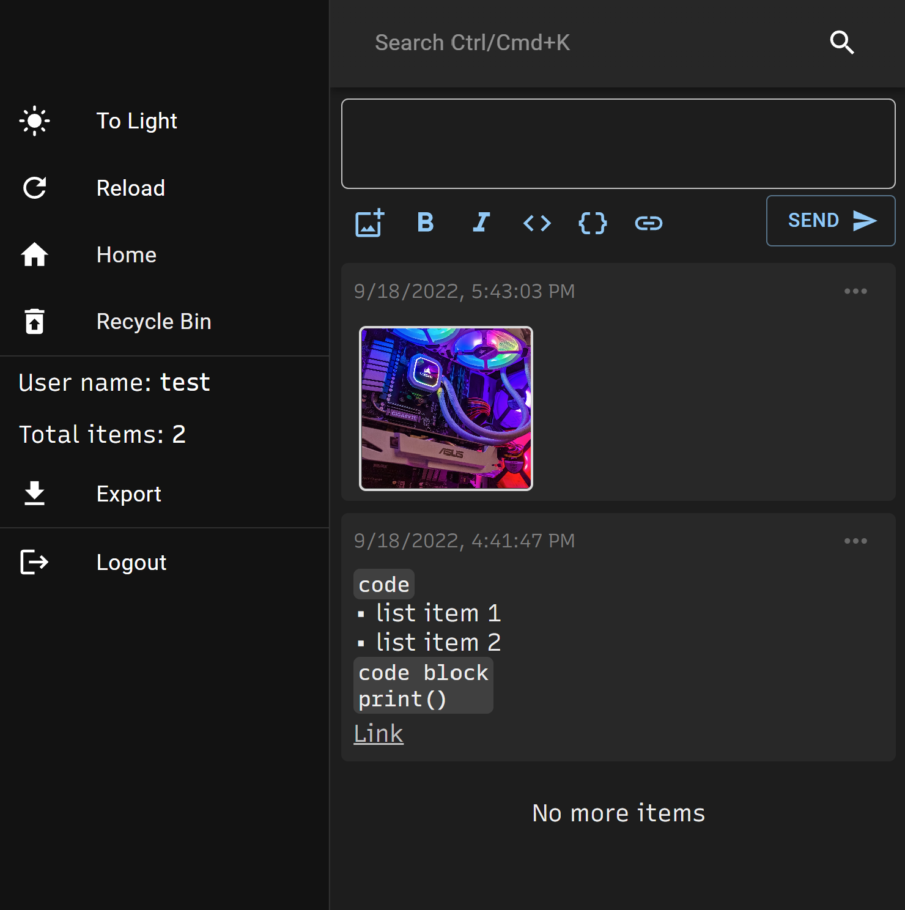
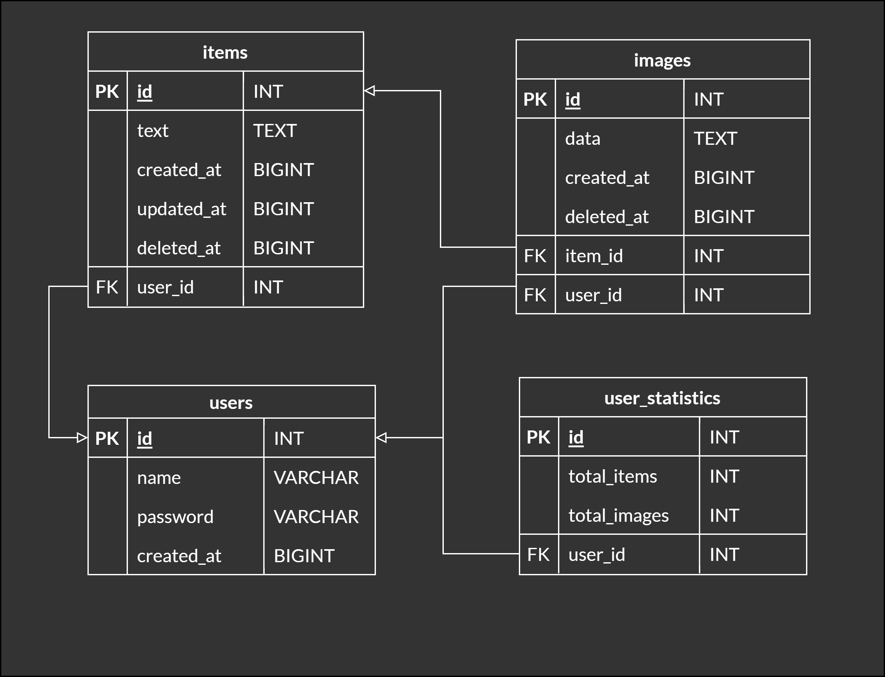

# Memo

A lightweight, self-hosted memo web application.
Built with TypeScript, React, Python, FastAPI and PostgreSQL.





## Requirements

- Python3.10
- FastAPI
- SQLAlchemy
- psycopg2-binary

Create `server/.env`

```sh
SECRET_KEY=generate using `openssl rand -hex 32`
ALGORITHM=HS256
ACCESS_TOKEN_EXPIRE_DAYS=7
DATABASE_URL=postgresql://{USER}:{PASSWORD}@{HOST}/{DB}
DATA_DIR=/data
LOG_PATH=/data/app.log
STAGE=dev
```

## Development Local

Frontend

```
cd frontend
npm install
npm start
```

Backend

```
docker compose up
```

Check API at `http://localhost:8000/docs`

## Data

Default settings:

Uploaded files are saved to `data/username/date/random hex`.
Log file is stored in `data/app.log`.
